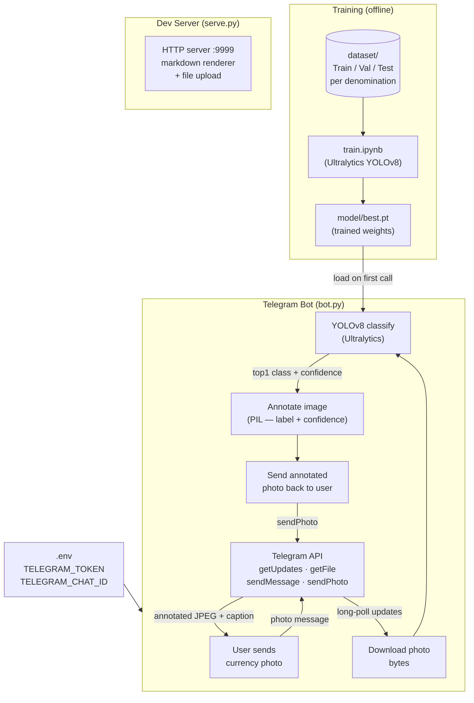

# Architecture — Currency Detector

A YOLOv8-based Indian currency note classifier that accepts photos via a Telegram bot, runs local inference using trained model weights, and replies with the detected denomination and confidence overlaid on the image.

## Components

| File | Role |
|------|------|
| `bot.py` | Telegram long-poll bot — downloads photos, runs inference, annotates and replies |
| `model/best.pt` | YOLOv8 classification weights trained on Indian currency notes |
| `train.ipynb` | Training notebook — loads dataset, trains YOLOv8, exports `best.pt` |
| `indian-currency-notes-classification.ipynb` | Exploratory classification notebook |
| `serve.py` | Local HTTP dev server (port 9999) for browsing project files and uploading images |
| `dataset/` | Train / Val / Test images organised by denomination subfolder |
| `.env` | `TELEGRAM_TOKEN` and `TELEGRAM_CHAT_ID` secrets |
